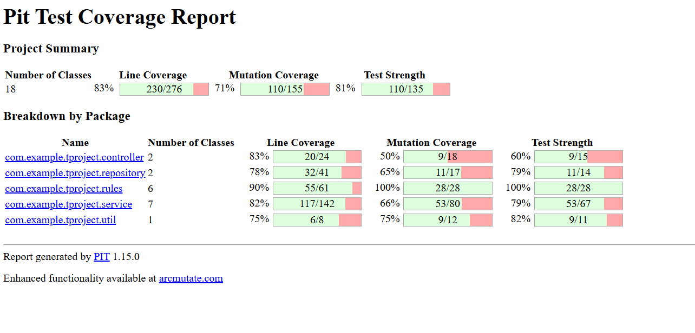

# 🛡️ Real‑Time Fraud Detection System

A Spring Boot–based fraud detection system that evaluates transactions using multiple risk‑based rules. The project focuses on improving software quality using **Mutation Testing (PIT)** to ensure strong test coverage and logic validation.

---

### ✨ Features
- Real‑time fraud scoring using multiple rule checks
- Generates decision (ALLOW / REVIEW / BLOCK) + risk level
- Maintains transaction risk history
- Well‑tested with **unit** and **integration** test suites
- Enhanced reliability proven through mutation testing

---

### 🧪 Mutation Testing
We used **PIT Mutation Testing** to measure how effective our tests are.  
Mutations in rules, services, and repositories were successfully killed by tests — showing strong logic validation.
- **Mutation Score:** ~70%
- **Line Coverage:** ~83%
- Ensures tests catch real faults, not just increase coverage %




---

### 🛠️ Tech Stack
- Java 17
- Spring Boot
- Maven
- JUnit 5
- PIT Mutation Testing

---

### ▶️ How to Run
```bash
# Clone this repository
git clone <repo-link>
cd fraud-detection

# Run the application
mvn spring-boot:run

# Execute tests
mvn test

# Run PIT Mutation Testing
mvn -DskipTests=false org.pitest:pitest-maven:mutationCoverage
